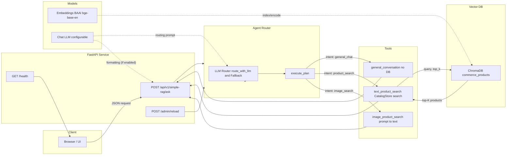

### PalonaAI Commerce Agent – README

PalonaAI is a multimodal, LLM-routed commerce assistant. It retrieves products from a vector database (ChromaDB) and generates concise recommendations. The system supports text and image queries, uses a simplified RAG path (Text/Image → Vector DB → Top K → formatting/fallback), and avoids static rules and hardcoded metadata. Recent updates add LLM-based image description, dynamic vocab extraction, and a keyword-match fallback for exact item names.

---

### Quick Start (5 steps)

1) Create env and install deps
```
python -m venv .venv
source .venv/bin/activate
pip install --upgrade pip
pip install -r requirements.txt
```

2) Configure your keys
```
cp env_template.txt .env
echo 'GOOGLE_API_KEY=YOUR_KEY' >> .env
echo 'LLM_MODEL=gemini-2.5-flash' >> .env
echo 'LLM_API_VERSION=v1' >> .env
```

3) Start the API (port 8080)
```
uvicorn api:app --host 0.0.0.0 --port 8080 --reload | tee -a api.log
```

4) Verify health
```
curl -s http://localhost:8080/health | jq .
```

5) Ask a question
```
curl -s -X POST http://localhost:8080/api/v1/simple-rag/ask \
  -H "Content-Type: application/json" \
  -d '{"text_input":"red t shirt"}' | jq
```

Tip: For image queries, send base64 in `image_base64`. See Quick commands.

---

### Architecture and Design Decisions

- Agent-as-Router (src/agent.py)
  - LLM-first routing: `_route_with_llm(message)` chooses one tool among `general_conversation`, `text_product_search`, `image_product_search`.
  - Immediate fallback: If the LLM is unavailable (quota/timeouts), a small, fast heuristic handles routing without blocking.
  - Clean separation of concerns: Router delegates to tools; tools each handle one responsibility.

- Simplified RAG
  - Text/Image → semantic retrieval from ChromaDB → top-K (strict 3) → LLM/fallback formatting.
  - Dynamic vocab built from catalog at runtime; no static color/brand lists.

- General Conversation Has No DB Access
  - General-chat responses do not query the DB and return empty metadata.

- Vector DB (ChromaDB) + BGE Embeddings
  - Persistent local vector store; minimal ops overhead.
  - BAAI/bge-base-en for strong semantic matching.

- Config-Driven
  - All key behavior is controlled via environment variables; no code changes for typical tuning.

---

### Architecture Diagram



---

### Agent API – Endpoints and Schemas

Base URL: `http://localhost:8080`

- GET `/health`
  - Response: `{ "status": "healthy", "service": "commerce-agent" }`

- POST `/api/v1/simple-rag/ask`
  - Request JSON:
    - `text_input: string | null`
    - `image_base64: string | null` (optional; when provided, the agent prioritizes image search)
    - `conversation_history: [{ user_input: string, agent_response: string }]` (optional)
    - `conversation_context: object` (optional)
  - Response JSON:
    - `response: string` (markdown)
    - `products: Product[]` (0..3)
    - `intent: "general_chat" | "product_search" | "image_search"`
    - `confidence: number`
    - `metadata: {}` (empty for general_chat)

- POST `/admin/reload`
  - Reloads .env/config and reinitializes agent/tools.

- POST `/api/v1/commerce-agent/ask-stream` (optional)
  - SSE stream of status events and final payload.

Product example:
```
{
  "name": "Adidas Ultraboost 22 Blue Running Shoes",
  "price": 189.99,
  "description": "Premium blue running shoes with responsive cushioning...",
  "attributes": { "brand": "Adidas", "color_family": "blue" },
  "category": ["Footwear"]
}
```

---

### Environment Variables and Dynamic Config

Copy `env_template.txt` → `.env` and set values.

Key variables:
- Server/UI
  - `API_PORT` (default 8080)
  - `UI_TITLE`, `UI_DESCRIPTION`, `UI_THEME`, `UI_MAX_WIDTH`, `UI_CHAT_HEIGHT`
- Vector DB
  - `CHROMA_PERSIST_DIR=./chroma_db`
  - `CHROMA_COLLECTION_NAME=commerce_products`
  - `CHROMA_FORCE_RELOAD=0`
- Search
  - `SEARCH_TOP_K=3` (strict maximum shown)
  - `SEARCH_SIMILARITY_THRESHOLD=0.7`
  - `MAX_CATALOG_PRODUCTS=10000`
- LLM
  - `LLM_MODEL` (e.g., `gemini-2.0-flash-exp` or your OpenAI-compatible model)
  - `GOOGLE_API_KEY` (or appropriate vendor key)
  - `MAX_RETRIES`, `API_TIMEOUT`
- Embeddings
  - `EMBEDDING_MODEL=BAAI/bge-base-en`

Notes:
- General chat never touches the DB; `metadata` is empty.
- Product search uses Chroma via `CatalogStore` only.

---

### Setup, Run, and Deployment

Prerequisites: Python 3.11+, macOS/Linux.

1) Environment and deps
```
python -m venv .venv
source .venv/bin/activate
pip install --upgrade pip
pip install -r requirements.txt
```

2) Configure env
```
cp env_template.txt .env
# edit .env with your keys and settings
```

3) Start API
```
python api.py
# → http://0.0.0.0:8080
```

4) Health check
```
curl http://localhost:8080/health
# {"status":"healthy","service":"commerce-agent"}
```

5) Test ask
```
curl -X POST http://localhost:8080/api/v1/simple-rag/ask \
  -H "Content-Type: application/json" \
  -d '{"text_input": "running shoes"}'
```

### Run the UI (Gradio)

UI expects the API to be running on `http://<api_host>:8080`.

1) Start/ensure API is running
```
uvicorn api:app --host 0.0.0.0 --port 8080 --reload | tee -a api.log
```

2) Launch the UI (port 7860)
```
python ui.py
# UI → http://0.0.0.0:7860
```

3) Use the chat
- Type a product request (e.g., "red t shirt").
- Optionally upload an image; the UI will convert it to base64 and send it to the API.
- The agent will route to text or image search and return top-3 products with links.

Deployment tips:
- Use a reverse proxy (nginx) and TLS.
- Persist `chroma_db/` to durable storage.
- Export logs to your observability stack.

---

### LLM Routing and Fallbacks

- Router selects `general_conversation`, `text_product_search`, or `image_product_search`. If an image is present, the agent routes to image search.
- Provider errors (429/timeouts) fall back to a minimal heuristic without blocking.
- Formatting can be done by LLM; a concise fallback formatter enforces the strict top-3 output.

---

### Vector DB, Embeddings, and Retrieval

- `CatalogStore` (ChromaDB) stores product text and metadata embeddings.
- `CatalogStore.search(query, top_k)` returns the most similar products.
- Results are strictly limited to 3 for presentation.
- If semantic retrieval returns none, a keyword-overlap fallback surfaces exact product names from `name`, `description`, and `search_text`.

---

### Store JSON data in DB (ChromaDB)

- ChromaDB metadata fields must be JSON-serializable primitives. For nested fields (lists/dicts), serialize to string when writing and deserialize when reading.
- This repo follows that pattern for `attributes.size`:
  - Write: `json.dumps(product['attributes'].get('size', []))` into metadata
  - Read: `json.loads(metadata.get('size', '[]'))` back into Python list

Minimal example (write/read):

```python
# write to Chroma: flatten nested fields into metadata-friendly values
metadata = {
    'id': product['id'],
    'name': product['name'],
    'price': product['price'],
    'brand': product['attributes'].get('brand', ''),
    'size': json.dumps(product['attributes'].get('size', [])),  # list -> string
}

# read from Chroma: reconstruct your nested structure
size_list = json.loads(metadata.get('size', '[]'))  # string -> list
product = {
    'id': metadata.get('id', ''),
    'name': metadata.get('name', ''),
    'price': metadata.get('price', 0),
    'attributes': {
        'brand': metadata.get('brand', ''),
        'size': size_list,
    }
}
```

Reference in code:

```118:139:src/vector_store/catalog.py
def _create_metadata(self, product: Dict[str, Any]) -> Dict[str, Any]:
    base_url = os.getenv("PRODUCT_BASE_URL", "https://example.com/products/")
    product_url = product.get("url") or f"{base_url}{product['id']}"
    metadata = {
        'id': product['id'],
        'name': product['name'],
        'description': product['description'],
        'price': product['price'],
        'availability': product['availability'],
        'brand': product['attributes'].get('brand', ''),
        'color_family': product['attributes'].get('color_family', ''),
        'material': product['attributes'].get('material', ''),
        'category': product['category'][0] if product['category'] else '',
        'size': json.dumps(product['attributes'].get('size', [])),
        'url': product_url
    }
    return metadata
```

```141:158:src/vector_store/catalog.py
def _metadata_to_product(self, metadata: Dict[str, Any], document: str) -> Dict[str, Any]:
    product = {
        'id': metadata.get('id', ''),
        'name': metadata.get('name', ''),
        'description': metadata.get('description', ''),
        'price': metadata.get('price', 0),
        'availability': metadata.get('availability', True),
        'category': [metadata.get('category', '')] if metadata.get('category') else [],
        'attributes': {
            'brand': metadata.get('brand', ''),
            'color_family': metadata.get('color_family', ''),
            'material': metadata.get('material', ''),
            'size': json.loads(metadata.get('size', '[]'))
        },
        'search_text': document,
        'url': metadata.get('url', '')
    }
    return product
```

Notes:
- Keep values small; ChromaDB metadata is intended for filtering and retrieval context.
- Use `where` filters on metadata fields for efficient constrained search (price, brand, color, category, availability).

### Tools Overview

- `general_conversation.py`
  - Handles greetings and general Q&A (name/capabilities/help) with no DB access; returns empty metadata.

- `text_product_search.py`
  - `search_products(query: str, top_k?: int)`: semantic retrieval via `CatalogStore.search()` with dynamic vocab (colors/brands/categories) extracted at runtime from the catalog; strict top-3 output; keyword fallback for exact names.

- `image_product_search.py`
  - Sends the uploaded image to an LLM with a strict JSON prompt to extract: `item_type`, `category`, `color`, `material`, `pattern`, `style`, `keywords`. The parsed description drives text search. Graceful fallback if the LLM is unavailable.

---

### Testing Strategy (suggested)

Automated:
- Routing: unit tests for tool selection + fallback paths.
- Retrieval: top-K and similarity threshold checks.
- API: integration tests for `/api/v1/simple-rag/ask` covering chat and product flows.

Manual smoke:
```
# General chat
curl -s -X POST http://localhost:8080/api/v1/simple-rag/ask \
  -H "Content-Type: application/json" -d '{"text_input":"hi"}' | jq

# Product search
curl -s -X POST http://localhost:8080/api/v1/simple-rag/ask \
  -H "Content-Type: application/json" -d '{"text_input":"running shoes"}' | jq
```

---

### Troubleshooting and Performance Notes

- Port in use
```
lsof -ti:8080 | xargs -r kill -9
```
- LLM quota exceeded
  - Router and formatter fall back instantly; consider switching providers or throttling.
- Vision 404 / image not processed
  - Ensure `GOOGLE_API_KEY` is set and `LLM_MODEL` supports image input (e.g., `gemini-2.5-flash`) and try `LLM_API_VERSION=v1beta`.
- Links not clickable in UI
  - The UI renders markdown links; ensure your browser is not blocking them.
- No products found
  - Ensure Chroma has items; first-run logs show collection counts.
  - Verify `SEARCH_TOP_K`, embedding model, and `catalog.json` ingestion.
- Slow first run
  - Embedding model is downloaded and cached on first use.
- Self-hosted LLMs
  - Very small models (~1–2B) may degrade routing/formatting; prefer ≥7B for stable quality.

---

### Quick commands (copy/paste)

- Env + install (fresh)
```
python -m venv .venv && source .venv/bin/activate && pip install --upgrade pip && pip install -r requirements.txt
```

- Minimal env (adjust your key)
```
export GOOGLE_API_KEY="<your_key>"; export LLM_MODEL=gemini-2.5-flash; export LLM_API_VERSION=v1
```

- Run API on 8080 (reload)
```
source .venv/bin/activate 2>/dev/null || true; uvicorn api:app --host 0.0.0.0 --port 8080 --reload | tee -a api.log
```

- Kill port 8080 if busy
```
lsof -ti:8080 | xargs -r kill -9
```

- Health check
```
curl -s http://localhost:8080/health | jq .
```

- Ask (text)
```
curl -s -X POST http://localhost:8080/api/v1/simple-rag/ask \
  -H "Content-Type: application/json" \
  -d '{"text_input":"red t shirt"}' | jq
```

- Ask (image)
```
IMG64=$(base64 -i ./sample.png 2>/dev/null || cat ./sample.base64)
curl -s -X POST http://localhost:8080/api/v1/simple-rag/ask \
  -H "Content-Type: application/json" \
  -d "{\"text_input\":null,\"image_base64\":\"${IMG64}\"}" | jq
```

- Reload config at runtime
```
curl -s -X POST http://localhost:8080/admin/reload | jq .
```

- Tail API logs
```
tail -f api.log
```

- Push current branch to GitHub
```
git add -A && git commit -m "chore: update docs and code" && git push -u origin $(git rev-parse --abbrev-ref HEAD)
```

### License

MIT
