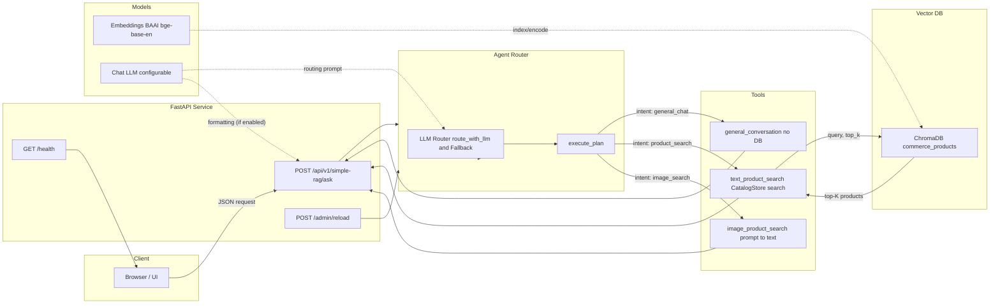

### PalonaAI Commerce Agent – README

PalonaAI is a production-ready, LLM-routed commerce assistant. It retrieves products from a vector database (ChromaDB) and generates concise recommendations. The system is LLM-driven for routing (with immediate fallback), uses a simplified RAG path (Text → Vector DB → Top K → LLM formatting/fallback), and avoids static rules and hardcoded metadata.

---

### Architecture and Design Decisions

- Agent-as-Router (src/agent.py)
  - LLM-first routing: `_route_with_llm(message)` chooses one tool among `general_conversation`, `text_product_search`, `image_product_search`.
  - Immediate fallback: If the LLM is unavailable (quota/timeouts), a small, fast heuristic handles routing without blocking.
  - Clean separation of concerns: Router delegates to tools; tools each handle one responsibility.

- Simplified RAG
  - Text → semantic retrieval from ChromaDB → top-K (strict 3) → LLM/fallback formatting.
  - No static filters; relevance is learned via embeddings and vector similarity.

- General Conversation Has No DB Access
  - General-chat responses do not query the DB and return empty metadata.

- Vector DB (ChromaDB) + BGE Embeddings
  - Persistent local vector store; minimal ops overhead.
  - BAAI/bge-base-en for strong semantic matching.

- Config-Driven
  - All key behavior is controlled via environment variables; no code changes for typical tuning.

---

### Architecture Diagram



---

### Agent API – Endpoints and Schemas

Base URL: `http://localhost:8080`

- GET `/health`
  - Response: `{ "status": "healthy", "service": "commerce-agent" }`

- POST `/api/v1/simple-rag/ask`
  - Request JSON:
    - `text_input: string | null`
    - `image_base64: string | null` (optional; currently prompts to use text description)
    - `conversation_history: [{ user_input: string, agent_response: string }]` (optional)
    - `conversation_context: object` (optional)
  - Response JSON:
    - `response: string` (markdown)
    - `products: Product[]` (0..3)
    - `intent: "general_chat" | "product_search" | "image_search"`
    - `confidence: number`
    - `metadata: {}` (empty for general_chat)

- POST `/admin/reload`
  - Reloads .env/config and reinitializes agent/tools.

- POST `/api/v1/commerce-agent/ask-stream` (optional)
  - SSE stream of status events and final payload.

Product example:
```
{
  "name": "Adidas Ultraboost 22 Blue Running Shoes",
  "price": 189.99,
  "description": "Premium blue running shoes with responsive cushioning...",
  "attributes": { "brand": "Adidas", "color_family": "blue" },
  "category": ["Footwear"]
}
```

---

### Environment Variables and Dynamic Config

Copy `env_template.txt` → `.env` and set values.

Key variables:
- Server/UI
  - `API_PORT` (default 8080)
  - `UI_TITLE`, `UI_DESCRIPTION`, `UI_THEME`, `UI_MAX_WIDTH`, `UI_CHAT_HEIGHT`
- Vector DB
  - `CHROMA_PERSIST_DIR=./chroma_db`
  - `CHROMA_COLLECTION_NAME=commerce_products`
  - `CHROMA_FORCE_RELOAD=0`
- Search
  - `SEARCH_TOP_K=3` (strict maximum shown)
  - `SEARCH_SIMILARITY_THRESHOLD=0.7`
  - `MAX_CATALOG_PRODUCTS=10000`
- LLM
  - `LLM_MODEL` (e.g., `gemini-2.0-flash-exp` or your OpenAI-compatible model)
  - `GOOGLE_API_KEY` (or appropriate vendor key)
  - `MAX_RETRIES`, `API_TIMEOUT`
- Embeddings
  - `EMBEDDING_MODEL=BAAI/bge-base-en`

Notes:
- General chat never touches the DB; `metadata` is empty.
- Product search uses Chroma via `CatalogStore` only.

---

### Setup, Run, and Deployment

Prerequisites: Python 3.11+, macOS/Linux.

1) Environment and deps
```
python -m venv .venv
source .venv/bin/activate
pip install --upgrade pip
pip install -r requirements.txt
```

2) Configure env
```
cp env_template.txt .env
# edit .env with your keys and settings
```

3) Start API
```
python api.py
# → http://0.0.0.0:8080
```

4) Health check
```
curl http://localhost:8080/health
# {"status":"healthy","service":"commerce-agent"}
```

5) Test ask
```
curl -X POST http://localhost:8080/api/v1/simple-rag/ask \
  -H "Content-Type: application/json" \
  -d '{"text_input": "running shoes"}'
```

Deployment tips:
- Use a reverse proxy (nginx) and TLS.
- Persist `chroma_db/` to durable storage.
- Export logs to your observability stack.

---

### LLM Routing and Fallbacks

- Router prompt asks the LLM to select: `general_conversation`, `text_product_search`, or `image_product_search`.
- On provider errors (429/timeouts), routing immediately falls back to a minimal heuristic without blocking.
- Formatting can be done by LLM; a concise fallback formatter enforces the strict top-3 output.

---

### Vector DB, Embeddings, and Retrieval

- `CatalogStore` (ChromaDB) stores product text and metadata embeddings.
- `CatalogStore.search(query, top_k)` returns the most similar products.
- Results are strictly limited to 3 for presentation.

---

### Tools Overview

- `general_conversation.py`
  - Handles greetings and general Q&A (name/capabilities/help) with no DB access; returns empty metadata.

- `text_product_search.py`
  - `search_products(query: str, top_k?: int)`: semantic retrieval via `CatalogStore.search()`, formats top-3.
  - Helpers: `get_product_categories()`, `get_brands()`, `search_by_category()`, `search_by_brand()`.

- `image_product_search.py`
  - Prompts the user to describe the image in text; delegates to `text_product_search`.

---

### Testing Strategy (suggested)

Automated:
- Routing: unit tests for tool selection + fallback paths.
- Retrieval: top-K and similarity threshold checks.
- API: integration tests for `/api/v1/simple-rag/ask` covering chat and product flows.

Manual smoke:
```
# General chat
curl -s -X POST http://localhost:8080/api/v1/simple-rag/ask \
  -H "Content-Type: application/json" -d '{"text_input":"hi"}' | jq

# Product search
curl -s -X POST http://localhost:8080/api/v1/simple-rag/ask \
  -H "Content-Type: application/json" -d '{"text_input":"running shoes"}' | jq
```

---

### Troubleshooting and Performance Notes

- Port in use
```
lsof -ti:8080 | xargs -r kill -9
```
- LLM quota exceeded
  - Router and formatter fall back instantly; consider switching providers or throttling.
- No products found
  - Ensure Chroma has items; first-run logs show collection counts.
  - Verify `SEARCH_TOP_K`, embedding model, and `catalog.json` ingestion.
- Slow first run
  - Embedding model is downloaded and cached on first use.
- Self-hosted LLMs
  - Very small models (~1–2B) may degrade routing/formatting; prefer ≥7B for stable quality.

---

### License

MIT
